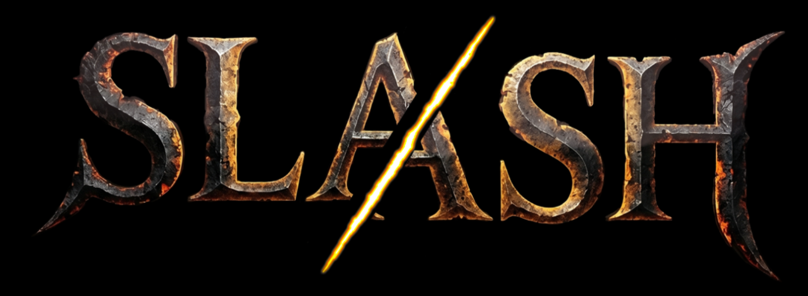

> # SLASH（スラッシュ）
> **氏名：佐竹 功（さたけ いさお）**
> 
> **制作者一覧（プログラマー３名）** 
> 氏名：佐竹 功（さたけ いさお） 
> 　主な担当：エンジン改造、プレイヤー挙動、シェーダー部分、システム
> 
> 氏名：林 彪（はやし ひょう） 
> 　主な担当：敵の挙動
> 
> 氏名：伊藤 侑生（いとう ゆうせい） 
>  　主な担当：UI、モデル担当
> 
> ---
> 
> 🔗 **リンク**
> * 💻 [GitHub リポジトリ](https://github.com/SatakeIsao/shSLASH)
> * 🎥 [YouTube プレイ動画](https://youtu.be/mnteVeTJ7gU)

 

# 目次
- [作品概要](#作品概要)
- [担当ソースコード](#担当ソースコード)
- [操作説明](#操作説明)
- [ゲーム説明](#ゲーム説明)
  - [◇ゲーム詳細](#ゲーム詳細)
  - [◇技術的なこだわり①：システム](#システム)
    - [1. 独自のトリガー判定システム「GhostBody」](#1-独自のトリガー判定システムghostbody)
    - [2. JSONホットリロード機能による開発環境の効率化](#2-jsonホットリロード機能による開発環境の効率化)
    - [3. ダブルバッファ構造を採用した「タスクスケジューラ」](#3-ダブルバッファ構造を採用したタスクスケジューラ)
    - [4. 状態遷移（ステートマシン）によるプレイヤーアクションと堅牢なステート管理](#4-状態遷移ステートマシンによるプレイヤーアクションと堅牢なステート管理)
    - [5. 敵キャラクターの「オブジェクトプール」によるFPS安定化](#5-敵キャラクターのオブジェクトプールによるfps安定化)
  - [◇技術的なこだわり②：レンダリング（カスタムシェーダー）](#技術的なこだわり②レンダリングカスタムシェーダー)
    - [1. 壁のディザリング透過による視認性向上（modelWall.fx）](#1-壁のディザリング透過による視認性向上modelwallfx)
  - [◇ゲームとしてのこだわり：UI・UX設計（演出と没入感）](#ゲームとしてのこだわりuiux設計演出と没入感)
    - [1. 「見た目」と「処理」を分離した3層構造UIシステム](#1-見た目と処理を分離した3層構造uiシステム)
    - [2. 数学的アプローチによる円形サークルゲージ（circularGauge.fx）](#2-数学的アプローチによる円形サークルゲージcirculargaugefx)
    - [3. 3乗イージングと減衰正弦波を用いた「斬撃ワイプ演出」](#3-3乗イージングと減衰正弦波を用いた斬撃ワイプ演出)
    - [4. 視線とゲームテンポを妨げないインゲーム「通知UI」](#4-視線とゲームテンポを妨げないインゲーム通知ui)
    - [5. 指数関数補間（Ease Out）によるHPバー回復演出](#5-指数関数補間ease-outによるhpバー回復演出)

 

# 作品概要
> <dl>
>  <dt>タイトル</dt>
>  <dd>SLASH（スラッシュ）</dd>
>  <dt>制作人数</dt>
>  <dd>3人（全員プログラマー）</dd>
>  <dt>制作期間</dt>
>  <dd>2026年4月～2026年6月の3か月間</dd>
>  <dt>ゲームジャンル</dt>
>  <dd>3Dアクションゲーム</dd>
>  <dt>プレイ人数</dt>
>  <dd>1人</dd>
>  <dt>使用言語</dt>
>  <dd>C++
>   
>  HLSL</dd>
>  <dt>使用ツール</dt>
>  <dd>Visual Studio 2026</dd>
>  <dd>Visual Studio Code</dd>
>  <dd>Adobe Photoshop 2026</dd>
>  <dd>3ds Max 2026</dd>
>  <dd>Effekseer</dd>
>  <dd>GitHub</dd>
>  <dd>Fork</dd>
>  <dd>Notion</dd>
>  <dd>Mixamo</dd>
>  <dt>開発環境</dt>
>  <dd>学校内製の簡易エンジン</dd>
>  <dd>Windows11</dd>
> </dl>

 

# 担当ソースコード

  ゲーム部分
  

### actor
* Actor.cpp / .h
* ActorState.cpp / .h
* ActorStateMachine.cpp / .h
* ActorStatus.cpp / .h
* BattleCharacter.cpp / .h
* CharacterSteering.cpp / .h
* EnemyPool.h
* Equipment.cpp / .h
* EquipmentSlot.cpp / .h
* EquipmentSlotManager.cpp / .h
* EventCharacterSpawnManager.cpp / .h
* EventCharacterSpawnManagerObject.cpp / .h
* Gimmick.cpp / .h
* QuadrantManager.cpp / .h
* Types.h

### battle
* BattleManager.cpp / .h
* IDamagePopListener.h

### camera
* CameraCommon.cpp / .h
* CameraController.cpp / .h
* CameraManager.cpp / .h
* CameraSteering.cpp / .h

### collision
* BoundingVolume.cpp / .h
* BroadphaseImpl.cpp / .h
* BroadphaseInterface.cpp / .h
* CollisionHitManager.cpp / .h
* GhostBody.cpp / .h
* GhostBodyManager.cpp / .h
* GhostPrimitive.cpp / .h
* PhysicalBody.cpp / .h
* Types.h

### core
* Fade.cpp / .h
* GameResultData.h
* ParameterManager.cpp / .h
* TaskSchedulerSystem.cpp / .h

### effect
* EffectManager.cpp / .h
* EffectManager2D.cpp / .h
* SwordDecalManager.cpp / .h
* Types.h

### math
* Transform.cpp / .h

### memory
* Allocator.cpp / .h
* Memory.cpp / .h

### resource
* ModelResource.cpp / .h
* ResourceManager.cpp / .h

### scene
* BattleScene.cpp / .h
* BootScene.cpp / .h
* DebugScene.cpp / .h
* GameOverScene.cpp / .h
* IScene.cpp / .h
* ResultScene.cpp / .h
* SceneManager.cpp / .h
* StartupScene.cpp / .h
* TitleScene.cpp / .h

### sound
* SoundManager.cpp / .h
* Types.h

### ui
* BattleSequence.cpp / .h
* DamagePopUI.cpp / .h
* GameOverSequence.cpp / .h
* HPBar.cpp / .h
* InGameUI.cpp / .h
* Layout.cpp / .h
* Menu.cpp / .h
* UIAnimation.cpp / .h
* UIAnimationFactory.h
* UIAnimationParameter.h
* UIParts.cpp / .h

### util
* CRC32.h
* Curve.cpp / .h
* JobSystem.h
* ParallelFor.h
* ThreadPool.h
* util.cpp / .h

### Gameディレクトリ直下
* Application.cpp / .h
* main.cpp
* stdafx.cpp / .h
* Types.h

  

   エンジン
   

  
  大文字は改造のみ
  * Bloom.cpp / .h
  * CameraCollisionSolver.cpp / .h
  * CircularGaugeRender.cpp / .h
  * CollisionObject.cpp / .h
  * DepthOfField.cpp / .h
  * FontRender.cpp / .h
  * IRenderer.cpp / .h
  * **k2EngineLow.cpp / .h**
  * LevelRender.cpp / .h
  * MapChipRender.cpp / .h
  * ModelRender.cpp / .h
  * MotionBlur.cpp / .h
  * MyRenderer.cpp / .h
  * PointLight.cpp / .h
  * RenderingEngine.cpp / .h
  * SceneLight.cpp / .h
  * Shadow.cpp / .h
  * Shadowing.cpp / .h
  * SkyCube.cpp / .h
  * SpringCamera.cpp / .h
  * SpriteRender.cpp / .h

   シェーダー
   

   
  * circularGauge.fx
  * coolTime.fx
  * debugWireFrame.fx
  * decal_forward.fx
  * decal_forward_dummy.fx
  * decal_gbuffer.fx
  * deferredLighting.fx
  * dof.fx
  * drawShadowMap.fx
  * gaussianBlur.fx
  * hpBar.fx
  * lightCulling.fx
  * model.fx
  * model_enemy_fade.fx
  * model_gbuffer.fx
  * model_gbuffer_nm.fx
  * model_gbuffer_ns.fx
  * model_gbuffer_wall.fx
  * modelWall.fx
  * motionBlur.fx
  * numberSprite.fx
  * postEffect.fx
  * skyCube.fx
  * sprite.fx
  * wipe.fx
 

 

# 操作説明

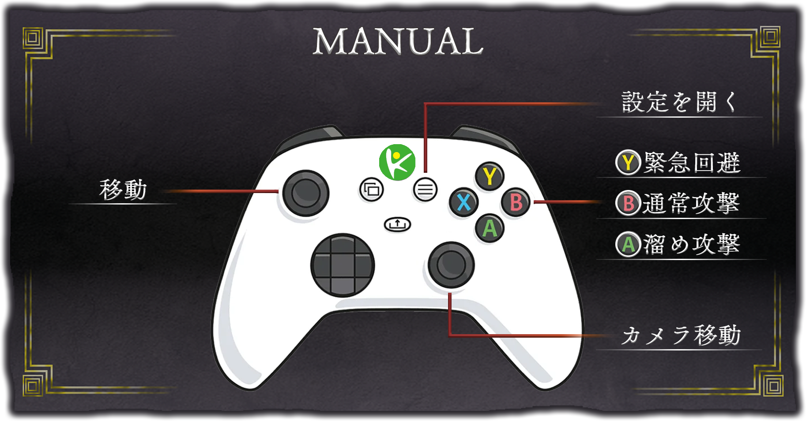

 

[⇧ 目次に戻る](#目次)

---

# ゲーム説明
 

## ◇ゲーム詳細
> ### 本作は、次々と現れる敵をひたすら倒してハイスコアを目指す、爽快感溢れる「無双系アクションゲーム」です。
> ### 撃破した敵の数やプレイヤーの到達レベルに応じてスコアが変動し、最終スコアに基づいて3段階の評価が下されます。
> ### ぜひ最高ランクである「MASTER」を目指して挑戦してください！

 

[⇧ 目次に戻る](#目次)

---

## ◇技術的なこだわり①：システムpure

### 独自のトリガー判定システム「GhostBody」
アクションゲームを作るにあたり、最初はすべて物理エンジン（BulletPhysics）を使って当たり判定を行おうとしました。しかし、「攻撃のダメージ判定」や「敵の視野」など、“すり抜けるが、接触だけ検知したい”という処理には、物理エンジンをそのまま使うのは処理が重くて扱いづらいと感じ、自作のセンサーシステム「GhostBody」の作成しました。
ただ動くものを作るだけでなく、「処理負荷を下げる工夫」と「バグが起きにくい設計」にこだわっています。

#### 1. 「総当たり」をやめて処理を軽くする工夫
当たり判定をすべてのキャラクターやギミック同士で計算すると処理落ちしてしまうと学んだため、判定処理を分ける工夫をしました。
まずは「近くにいるペア」だけをリストアップする広域判定を実装しました。さらに、細かい判定をする直前にも、「お互いを囲む大きな球」の距離を測って、そもそも届いていなければ重い計算をスキップする（早期リターン）処理を入れることで、ゲーム全体のパフォーマンスを最適化しています。

#### 2. ビット演算で「誰が何と当たるか」をスマートに管理
制作初期は「もし相手が敵だったら…」という判定処理を `if` 文で書いていたのですが、土管やコインなどのギミックが増えるたびにコードが複雑化し、可読性が低いコードになってしまいました。
そこで、「ビット演算」を使って管理するようにしました。例えばプレイヤーの属性（Attribute）を `1 << 0` にして、当たりたい相手（Mask）を `Enemy | Pipe | Coin` に設定することで、複雑な条件も一瞬のビット計算で判定できるようにしました。これで新しいギミックを追加するのが楽になりました。

#### 3. メモリリークを起こさないための自動管理
攻撃のたびに当たり判定を作ったり消したりしていると、「消し忘れ」によるバグやメモリリークが起きないか不安でした。
そこで、リソース確保と初期化をまとめる手法を意識して設計しました。`GhostBody` が作られたら自動でマネージャーに登録され、デストラクタに自動でリストから外れる仕組みにしています。また `std::unique_ptr` を使うことで、新しいサイズの判定を作り直すだけで古いメモリが安全に消えるようにし、メモリ周りのエラーを未然に防いでいます。

#### 4. 「判定」と「リアクション」を分割
プログラミングを進める中で、「当たったか調べるループ処理」の中で直接HPを減らしたりキャラクターをワープさせたりすると、エラーが起きやすくなることに気づきました。
そこで、専用の `CollisionHitManager` クラスを作りました。当たったペアの情報をいったんリストに保存しておき、すべての判定が終わったあとに、まとめてダメージ処理やノックバック処理を行うようにしました。これで処理の順序が整理され、予期せぬバグを減らすことができました。

 

[⇧ 目次に戻る](#目次)

### 「開発環境の構築」と「C++のバグ対策」
ゲームを制作する中で、「ジャンプの挙動を少し変えるだけでビルドに何十秒も待たされる」「時間差の処理を入れると原因不明のクラッシュが起きる」という問題にぶつかりました。
これらを「根本的なシステム構造」から解決することに挑戦しました。

#### 1. 「JSONホットリロード」
アクションゲームの面白さは「手触り」で決まると考えています。しかし、C++のコードに直接数値を書いていると、微調整のたびにコンパイル待ちが発生し、トライ＆エラーの回数が減ってしまうことに課題を感じていました。
この「ビルド待ち」のストレスを無くし、開発効率を高めるため、独自の「ホットリロード機能」を実装しました。

* **仕組み：** パラメータやUIのレイアウト情報を外部のJSONファイルで管理し、プログラム側でそのファイルの「最終更新時刻」を毎フレーム監視するようにしました。
* **成果：** ゲームを起動したままエディタでJSONを上書き保存すると、即座に最新の数値が画面に反映されます。これにより、ゲームを止めることなく「遊びながら数値を変更する」環境ができ、アクションやUIのクオリティアップにつながりました。

#### 2. 「タスクスケジューラ」
「パンチアニメーションの0.1秒後に当たり判定を出し、さらに0.1秒後に消す」といった遅延処理を安全に実装するため、ラムダ式で処理を予約できる `TaskSchedulerSystem` を自作しました。

* **直面した絶望的なクラッシュ：**
  最初は `std::vector` にタスクを詰め込み、ループで回して実行していました。しかし、「実行中のタスクの中で、さらに新しいタスクが予約される」という状況が発生した瞬間、ゲームが前触れもなくクラッシュするようになってしまいました。
* **原因の究明（イテレータの無効化）：**
  ブレークポイントを置いてメモリを追った結果、ループの最中に配列へ `push_back` されたことで、C++内部でメモリ領域の再確保が走り、参照していたアドレスが破壊される現象が原因だと突き止めました。
* **構造レベルでの解決策：**
  `if` 文などで直すのではなく、タスクのリストを「今のフレームで実行するもの」と「次のフレームに回すもの（`pendingNextFrameEvents_`）」の2つに完全に分離する**ダブルバッファ構造**へ再設計しました。フレームの最後に `swap` を使って安全にリストを入れ替えることで、どんなに複雑な遅延処理が連鎖してもクラッシュしない、スケジューラを完成させました。

 

[⇧ 目次に戻る](#目次)

### プレイヤーのアクション実装と堅牢なステート管理
プレイヤーの全アクションを状態遷移（ステートマシン）で管理し、操作性の向上とバグの出にくい設計を両立させました。各ステートは `Enter` / `Update` / `Exit` / `CanChangeState` の4つのメソッドで構成され、遷移条件をステート側が自己申告する設計にしています。

#### 1. 入力を気持ちよく反映する「回避」と「コンボ攻撃」
* **回避アクション：** `Enter` 時に入力方向を確定させることで、「回避モーション中にスティックを別方向に倒しても、不自然に向きが変わらない」仕様にしました。内部で `SetAvoiding(true)` を呼び出して無敵フラグを立て、線形減速（リニアな減衰計算）を用いて滑らかに減速しながら停止する心地よい手触りを実現しています。

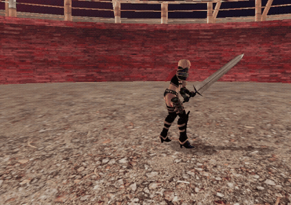

* **通常攻撃（3コンボ）：** `ComboAttackCharacterState` を基底クラスとし、各コンボを派生クラスで `GetComboParam()` をオーバーライドして実装する「テンプレートメソッドパターン」を採用しました。コンボ入力を `isComboInput_` フラグで記録し、入力があれば受付時間経過後に次のコンボへ遷移、なければアニメーション終了まで待機します。攻撃判定の発生・消滅タイミングは、自作の `TaskSchedulerSystem` を用いてミリ秒単位で遅延制御しています。

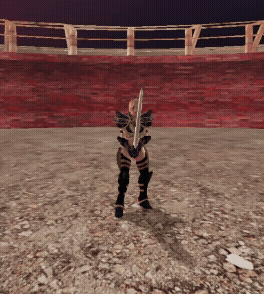

#### 2. 緩急をつけた「溜め攻撃」と「モーションブレンド」
* **溜め攻撃：** `Start`（チャージ） → `Looping`（ボタン押し続け） → `End`（発射）の3フェーズで管理。特に `End` への遷移時は、アニメーションの再生速度をあえて「2倍」に引き上げることで、溜めたパワーを一気に解放して素早く振り抜く、アクションとしての爽快感を表現しました。

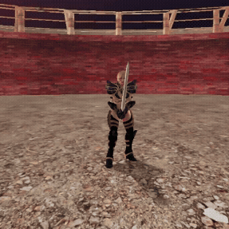

* **滑らかなモーションブレンド：** `PlayAnimation(種別, ブレンド時間)` を実装し、ステートごとに最適な補間時間を調整しました。これにより、激しいコンボから回避、あるいは静止状態への移行が不自然にコマ飛びせず、滑らかに繋がるようにしています。

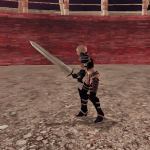

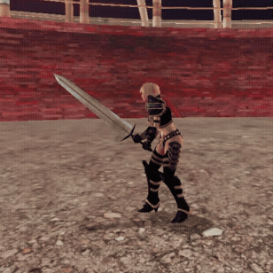

#### 3. HPに連動する動的なモーション変更
毎フレーム `IsInjured()` による残りHPの割合を判定しています。HPが一定値を下回ると、自動的に `InjuredIdle`（負傷待機）や `InjuredRun`（負傷走り）ステートへ切り替わる仕組みを構築しました。
負傷状態では移動速度が「0.5倍」に制限され、敵からノックバック攻撃を受けた後であっても、起き上がり時には再び自動で負傷ステートに戻るようステートの優先度を制御しています。

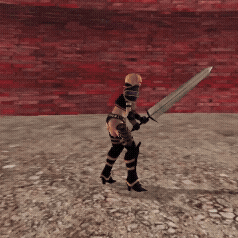

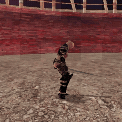

 

[⇧ 目次に戻る](#目次)

### 敵キャラクターの「オブジェクトプール」によるFPS安定化
当初は敵キャラクターが出現・死亡するたびに `new` / `delete` による動的メモリ確保（ヒープアロケーション）を行っていました。しかし、敵が同時に多数死亡した瞬間にメモリの解放処理が集中し、FPSが瞬間的に低下する「スパイク現象」が発生していました。

#### 1. 起動時の一括生成とアクティブ管理
この負荷を解消するため、ゲーム起動（シーン初期化）時に最大出現数の敵オブジェクトをメモリ上に一括生成（`new`）して `EnemyPool` に格納しておく「オブジェクトプールパターン」を導入しました。
* **敵の出現時：** プール内から未使用（非アクティブ）のオブジェクトを検索し、座標を設定してアクティブ化します。
* **敵の死亡時：** `delete` は呼ばず、オブジェクトの描画と衝突判定をオフにして「非アクティブ」状態に戻すだけに留めます。

#### 2. 導入の成果
ゲーム中のリアルタイムなメモリ確保・解放を完全に「ゼロ」にしたことで、敵が次々と押し寄せて激しく撃破される無双系アクションでありながら、処理落ち（コマ落ち）のない極めて安定した高フレームレート（60FPS）を維持することに成功しました。

 

[⇧ 目次に戻る](#目次)

---

## ◇技術的なこだわり②：レンダリング

### 壁のディザリング（カメラと壁の間のキャラクター視認性向上）
3Dアクションゲームにおいて、カメラとプレイヤーの間に遮蔽物（建物や壁）が入り込むと、自キャラが見えなくなりプレイの快適性が著しく損なわれます。
この問題を解決するため、アルファブレンドによる半透明描画ではなく、カスタムシェーダー（`modelWall.fx`）を用いた**順序付きディザリング透過**を実装しました。

#### 1. なぜアルファブレンドを使わなかったのか
一般的な半透明処理（プレマルチプライド・アルファ等）は、描画コストが高いだけでなく、不透明オブジェクトとの描画順序の並び替え（ソート問題）や、Zバッファへの書き込み制限など、3Dエンジンレベルで管理が非常に複雑になるデメリットがあります。そこで、描画順序を変更せずに不透明パスのまま透過を表現できるディザリングを選択しました。

#### 2. ベイヤー行列によるピクセル間引きとフェード表現
GPU（ピクセルシェーダー）側で、4×4の「ベイヤー行列」を用いてスクリーン座標から閾値を抽出。カメラと壁との距離から算出した間引き率（`clipRate`）と数値を比較し、HLSLの `clip()` 関数によってピクセルを網目状に間引く仕組みにしています。カメラが壁に接近するほど自動的に間引き率が上がり、壁が自然にサラサラと透けていくような視覚効果を生み出しました。

#### 3. 法線と高さによる適用範囲の限定
ディザリングを単純に壁モデル全体へ適用すると、カメラの角度によって「透けてほしくない床や天井、柱の曲面」まで一緒に透けてしまい、空間の立体感が崩れてしまう問題が発生しました。
そこで、頂点シェーダーから渡される**「法線のY成分（真上を向いている面を弾く）」**と**「カメラの高さ（一定以上の高低差がある遮蔽物のみを対象にする）」**を条件式に組み込み、プレイヤーを真に遮っている「壁面」だけにディザリングが限定して適用されるよう最適化しました。

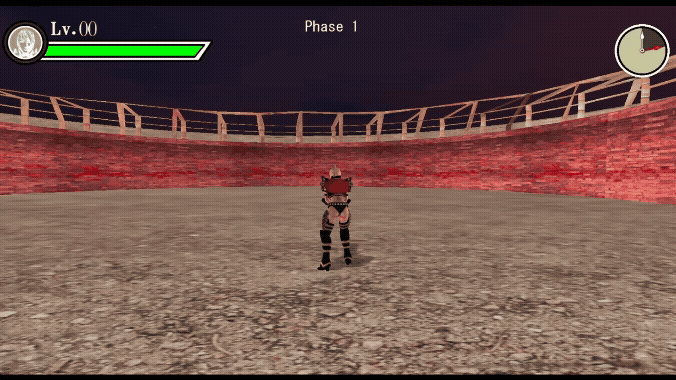

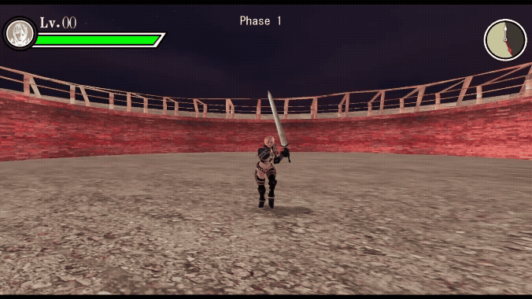

 

[⇧ 目次に戻る](#目次)

---

## ◇ゲームとしてのこだわり①：UI・UX設計

### 「見た目」と「処理」を分けたUIシステム
ゲーム制作中で、「ボタンの位置を少しずらすだけで、毎回C++のコードを書き換えてビルドを待たなければならない」というUI調整の煩わしさに直面しました。
そこで、UIの仕組みを根本から作り直しました。

#### 1.「UIParts」「Layout」「Menu」の3層構造
最初は「画像の表示」も「座標の指定」も「コントローラーの入力」も全部1つのファイルに書いていたため、どこに何が書いてあるか分からない状態になっていました。これを解決するため、役割を3つのクラスにスッキリ分けました。

* **UIParts（部品）：** 画像やテキストなど、画面を構成する最小単位のパーツです。
* **Layout（見た目）：** 複数の `UIParts` を並べて「1つの画面」を作るクラスです。
* **Menu（裏側の処理）：** 「カーソルを動かす」「決定ボタンを押す」といった入力判定やロジックだけを担当するクラスです。

「見た目（Layout）」と「処理（Menu）」を完全に分けたことで、UIのデザインを直したい時と、ボタンの処理を直したい時で見るべきコードが明確になり、バグが減りました。

#### 2. JSONを使った自動レイアウト
C++のコードに直接「X座標=100、Y座標=200」と書くのをやめ、UIの配置データをすべて外部のJSONファイル（`titleMenu.json` など）にまとめました。
`Layout` クラスは、指定されたJSONファイルを読み込んで、そこに書かれた設定どおりに自動でパーツを配置してくれます。
これにより、ゲームを起動したままJSONの数字を書き換えるだけでUIが動くようになり、微調整のたびに発生していた「ビルド待ちのイライラ」を無くすことができました。

#### 3. 親クラス（Menu）を作ってUI量産のスピードアップ
「タイトル画面」「ポーズ画面」「ゲームオーバー画面」など、複数のUI画面を作るにあたり、フェードイン・アウトやカーソル移動の音など「どの画面でも共通する処理」を親クラスである `Menu` にまとめました。
新しく画面を追加したい時は、この `Menu` クラスを継承して「Aボタンを押したらどうするか」というその画面独自の処理だけを書けば済むように設計したことで、新しいUIを作るスピードが上がりました。

 

[⇧ 目次に戻る](#目次)

### シェーダーで実装した円形サークルゲージ（タイマー・経験値）
テクスチャの切り替えやマスク画像に頼ることなく、HLSLシェーダー（`circularGauge.fx`）上で数学的に円弧を描画する動的なサークルゲージを実装しました。

#### 1. atan2による角度計算とパラメータ化
ピクセルシェーダー内で、テクスチャのUV座標から中心点へのベクトルを求め、`atan2` 関数を用いて角度を算出。その角度が現在の進捗率（0.0〜1.0）以下であるかどうかで描画を切り替えています。
さらに、シェーダーにバッファ経由で渡す `innerRadius`（内径）、`outerRadius`（外径）、`arcSpan`（円弧を開く角度）などの数値を変更するだけで、形状を自在に変えられる汎用的な設計にしました。これにより、**「制限時間タイマー」と「経験値ゲージ」という全く見た目の異なる2つのUIを、1枚のシェーダーファイルで使い回す**ことに成功し、ビデオメモリと描画パスを節約しています。

#### 2. 多層スプライト構成と滑らかなアニメーション
* **タイマーゲージ：** 時計としてのメカニカルな美しさを出すため、色やサイズ、役割の異なる5つのサークル状スプライトを背面に重ね合わせ、立体感のある多層構造に仕上げました。

* **経験値ゲージ：** 敵を倒した際にゲージの数値が即座に切り替わるのではなく、線形補間（`Lerp`）を用いて「ぐいっと滑らかに上昇する」アニメーションを施しました。また、100%に達した瞬間に内部データをリセットし、レベルアップの数値をインクリメントした上で残りの経験値を次のレベルへ繰り越すリセット・ラップ処理を緻密に実装しています。

 

[⇧ 目次に戻る](#目次)

### タイトルロゴへのダイナミックな「斬撃ワイプ演出」
タイトル画面からゲームが開始される瞬間、ユーザーのボルテージを最高潮に高めるため、メインロゴが刀で切り裂かれて左右に割れるダイナミックな演出を実装しました。

#### 1. カスタムシェーダー（wipe.fx）による斜め切り
ロゴの切断エフェクトには、専用のワイプシェーダーを作成しました。各ピクセルの二次元座標を、斬撃の角度に合わせた「ワイプ方向ベクトル」へ射影し、進行度に応じて `clip()` することで、画像が斜め45度のラインに沿って鮮やかに消えていく（切り抜かれる）演出を可能にしました。
CPU側では、演出の進行度を単なる等速ではなく **$t^3$（3乗イージング）** で制御。これにより、最初は静かに始まり、一瞬で鋭く切り抜けるという「刀特有の鋭い速度感」をUIの動きで表現しています。

#### 2. 状態機械（ステート）で制御するロゴの減衰振動（シェイク）
ワイプが完了した瞬間、あらかじめ「左半分」「右半分」に分割して用意しておいたテクスチャに切り替え、それぞれの座標を外側へと開かせます。さらに、斬撃の凄まじい衝撃を表現するため、画面とロゴを2段階に激しく揺らすシステムを構築しました。
この揺れは、手書きの座標変更ではなく専用の状態機械（`ShakeStep1`〜`4`）で管理しています。
$$\text{振幅} \times \sin(\text{周波数} \times t) \times e^{-\text{減衰} \times t}$$
の数式（減衰正弦波）をベースにプログラムを組み、激しい跳ね上がりから徐々に揺れが収束していくリアルな物理挙動を再現。タイムラグ（ディレイ）の数値をミリ秒単位で調整することで、ただ揺れるだけではない「重厚感のある衝撃」をフィードバックとしてユーザーに伝えています。

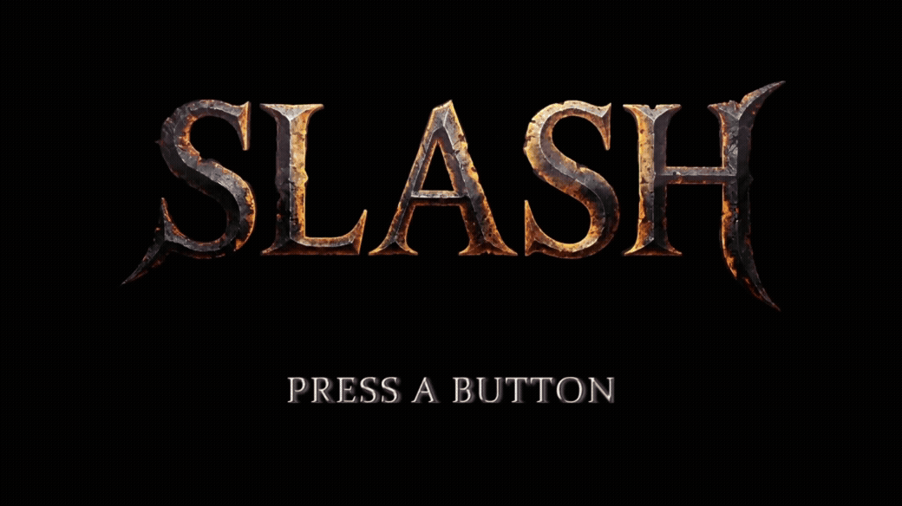

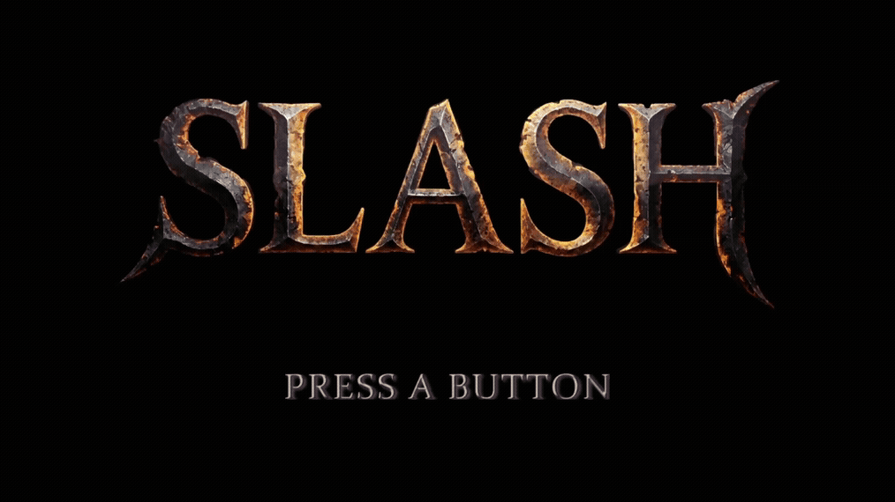

 

[⇧ 目次に戻る](#目次)

### プレイヤーの視線を妨げない「通知UI」と「HPバー回復演出」
インゲーム中の情報通知は、プレイヤーが敵との戦いに100%集中できるよう、視線誘導の心地よさと「プレイの邪魔をしないこと」を最優先に設計しました。

#### 1.「レベルアップ通知」
レベルアップ時に画面中央に表示されるバナー（Level UP / 攻撃力UP）は、ゲームのテンポを崩さないよう徹底的に配慮しました。
* **状況に応じた出し分け：** 本作のシステム上、攻撃力が上昇するのは「偶数レベルのみ」です。そのため、奇数レベル時は「Level UP」バナー単体、偶数レベル時は時間差で「攻撃力UP」が下部に出現する2段表示へと、ロジック側で動的にレイアウトを出し分けています。
* **没入感を削がないアニメーション：** 視線を奪いすぎる派手な点滅や画面の揺れはあえて排し、`UITranslateAnimation`（スライドイン）と `UIColorAnimation`（フェード）を組み合わせたスマートな動きに抑えました。
* **リサイクル設計：** 表示後「2.0秒」で自動的に画面外へ退場（フェードアウト）させると同時に、座標と透明度を内部で即座に初期化。これにより、次のレベルアップ時にも同じUIインスタンスを安全に再利用できるメモリ効率の良い仕組みにしています。

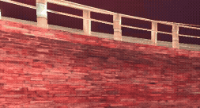

#### 2. 数字が叩きつけられる「レベル数値アニメーション」
レベルが上がった瞬間、数値のフォント自体が上から降ってきて着地する2段階のアニメーションを実装しました。
* **Phase 1（落下）：** $t^3$ の3乗EaseInを用いて、重力に従って加速度的に文字が叩きつけられるような「重さ」を表現。
* **Phase 2（衝撃吸収）：** 着地した瞬間に、前述の減衰正弦波を用いて文字を細かく縦揺れさせ、物理的に自然に収束するシェイクを施しました。
さらに、手前の「Lv.」という固定アイコンは、数字の着地から**あえて「0.06秒」遅らせ、振幅を小さくして揺らす**処理を入れています。これにより、「数字が着地した衝撃が、隣のアイコンへ時間差で伝わった」ようなリアルな手触りと弾力感を演出し、文字に命を吹き込んでいます。

<table>
<tr>
<td></td>
<td></td>
</tr>
</table>

#### 3. 視覚的メリハリをつけた「HPバー」の指数関数補間
ダメージと回復で、ゲージの減少・増加速度のアルゴリズムを変えることで、バトルの緊張感を高めています。
* **回復の演出（指数関数）：** HP回復時は **$1 - 2^{-10t}$（Exponential Ease Out）** の指数関数を用いてゲージを補間しました。これにより、回復した瞬間は「一瞬でドカンとゲージが伸び」、満タンに近づくにつれて「スッと滑らかに減速して吸い込まれる」ようになります。この緩急により、プレイヤーに「体力がグッと大きく回復した！」という強い安心感と手応えを与えます。さらにゲージが90%に達した瞬間に `healEffectFired_` フラグをトリガーし、HPバーの右端（先端）にきらめく回復エフェクトを一度だけジャストタイミングで再生させています。

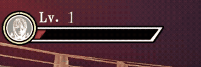

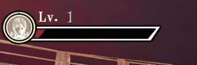

 

[⇧ 目次に戻る](#目次)